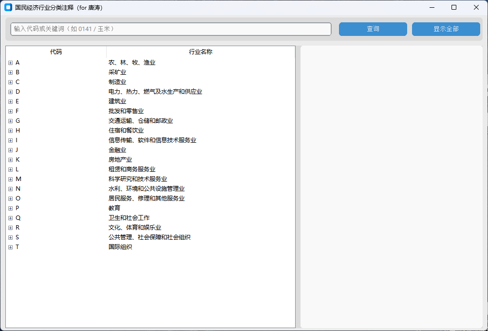
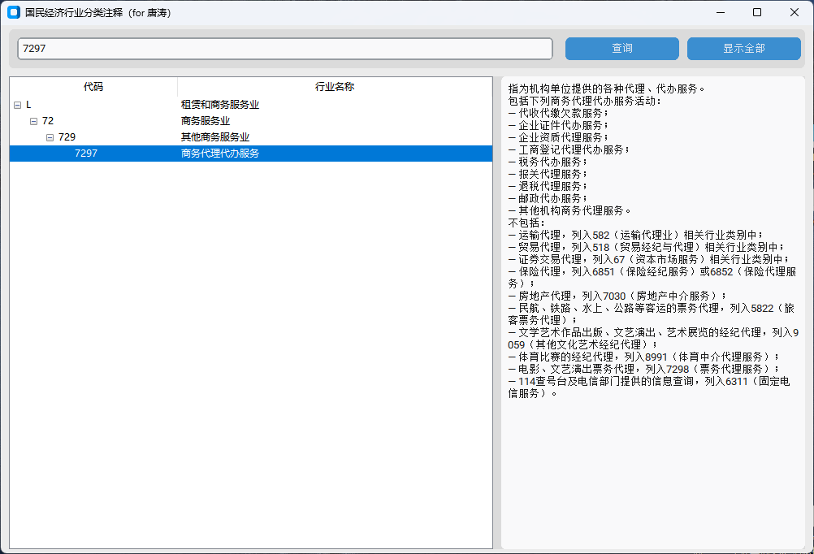

# 国民经济行业分类注释查询软件(2017年)

专为媳妇唐涛开发的**国民经济行业分类注释查询软件（2017年）**

## 功能

- 层次树结构展示所有行业、代码、说明
    - pandas清洗`2017年国民经济行业分类注释.xlsx`文件，生成层次树数据结构
- 快速筛选（根据行业代码、模糊匹配关键词）
    - 自动展开父节点
    - 高亮模糊匹配关键词（红色）

## 技术栈

- uv
    - `uv sync`
    - `uv run main.py`
- python

## 数据来源

[国家统计局-《2017国民经济行业分类注释》](https://www.stats.gov.cn/sj/tjbz/gmjjhyfl/202302/t20230213_1902780.html)

## PyInstaller打包exe

- `uv pip install customtkinter pyinstaller`
- `uv pip show customtkinter`
- `uv run pyinstaller --noconfirm --windowed --onedir --name 国民经济行业分类注释 --add-data "国民经济行业分类注释.json;." --add-data "F:/VisualStudioCodeProjects/economic-explanatory-notes/.venv/Lib/site-packages/customtkinter;customtkinter/" main.py`